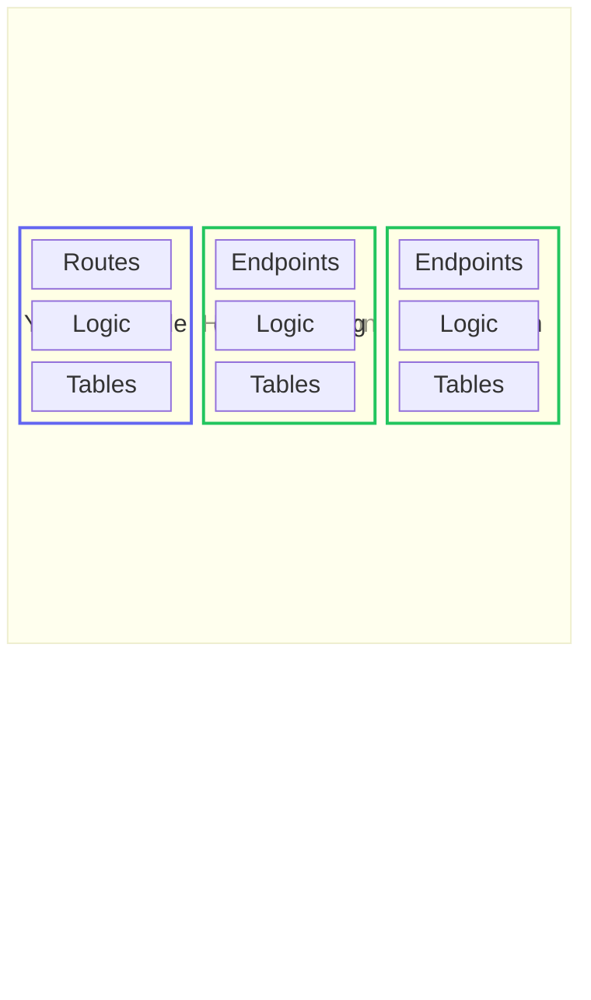

# Futonic 🛋️

**A framework for building services that embed into host applications instead of deploying alongside them.**

## The problem

There are plenty of services available as easy-to-deploy containers — auth servers, payment processors, observability tools. But for most applications, deploying multiple containers (one for the main app plus one for each service) is a waste. An auth server, a payment webhook handler, and an observability stack don't each need their own process. They could share compute and a database without any meaningful noisy-neighbor issues — because let's be honest, most apps these days are just wrappers around heavier services anyway.

## The idea

Futonic is heavily inspired by [better-auth](https://github.com/better-auth/better-auth)'s service embedding paradigm — the insight that many services don't need their own process, their own deployment, or even their own database. They just need a place to crash.

Futonic is a framework for building **embeddable services** that crash on a host application's futon. They share the host's compute. They share the host's database. They wake up when needed and stay out of the way when they're not.

No separate containers. No extra Dockerfiles. No internal networking. Just services that live inside the host app — and a great DX for building them.

## Why build embeddable services

**Your users save money:**
Most apps aren't mega-scale. They're tools, SaaS products, and indie projects where every dollar of infrastructure counts. When your service embeds directly into the host, your users don't need to pay for another container sitting idle 99% of the time.

**Your users get a better dev experience:**
No more `docker-compose up` with 6 services just to work on a feature. No more debugging why the auth container can't talk to the payments container on a laptop. Embedded services run in-process. Switch branches, switch worktrees — everything just works.

**Simplicity sells:**
Fewer moving parts means fewer things that break at 2am. One deploy. One database. One set of logs. Developers can always decompose later if they outgrow it — but most apps never will. The easier your service is to adopt, the more people will use it.

## How it works: the vertical slice

A futonic service is a **vertical slice** of your application. It defines everything from the client interface down to the database — API endpoints, input validation, business logic, and table schemas — as a single, self-contained unit.



Each green block is a futonic service — a vertical slice that owns its entire stack, published as an npm package. The host application mounts them alongside its own code. They all share one process, one database, one deployment.

This is what makes futonic different from microservices. A microservice is also a vertical slice, but it pays for that independence with its own container, its own deployment pipeline, and network hops between every call. A futonic service gets the same self-containment for free:

- **No deployment cost.** It runs inside your existing process. No extra containers, no extra infrastructure, no extra cloud bill.
- **No networking latency.** Service calls from backend code are direct function calls — same process, same database connection pool, zero serialization.
- **No protocol constraints.** Endpoints are built on web standard `Request`/`Response`, so a service can return JSON, full HTML pages, server-sent event streams, file downloads — anything `Response` supports.

### What a service looks like

A service defines its database tables and API endpoints. The service author publishes this as an npm package:

```typescript
// @acme/billing

import { createService } from "futonic";

export const billing = createService({
  id: "billing",
  version: "0.1.0",
  dbSchema: {
    tables: {
      invoices: {
        fields: {
          id: { type: "string", primaryKey: true, required: true },
          amount: { type: "number", required: true },
          status: { type: "string", required: true },
        },
      },
    },
  },
  endpoints: createBillingEndpoints, // the endpoints factory, defined below
});
```

Endpoints are an `(use) => endpoints` factory. Futonic passes in the middleware that injects a `ServiceContext` — giving each endpoint scoped access to the service's database tables, config, and logger:

```typescript
import { createEndpoint, type Middleware } from "better-call";

export function createBillingEndpoints(use: Middleware[]) {
  return {
    createInvoice: createEndpoint(
      "/invoices",
      { method: "POST", use, body: z.object({ amount: z.number(), status: z.string() }) },
      async (ctx) => {
        const svc = ctx.context.serviceCtx;
        const invoice = await svc.db.invoices.create({
          id: crypto.randomUUID(),
          ...ctx.body,
        });
        svc.logger.info(`Invoice created: ${invoice.id}`);
        return invoice;
      },
    ),
  };
}
```

The endpoint writes to `svc.db.invoices`, but the actual table in the database is `billing_invoices` — automatically prefixed with the service ID. A second service with its own `invoices` table would hit a completely separate table. Same database, no collisions.

### How the host mounts it

The host developer installs the service and runs it — they never import futonic themselves. Futonic auto-detects the database driver — `pg`, `mysql2`, `better-sqlite3`, or `bun:sqlite`:

```typescript
import { billing } from "@acme/billing";

const svc = billing({
  database: pool,  // Their existing pg.Pool, mysql2 pool, or sqlite instance
  mount: "/api/billing",
  baseURL: "http://localhost:3000",
});

await svc.init();
```

Then a single catch-all route in their framework of choice. `svc.handler` is a web-standard `(Request, { basePath }) => Response` handler — pass the mount path so it can strip the prefix before routing to root-defined endpoints:

```typescript
// Hono
app.all("/api/billing/*", (c) => svc.handler(c.req.raw, { basePath: "/api/billing" }));

// Next.js — app/api/billing/[...path]/route.ts
const handler = (req: Request) => svc.handler(req, { basePath: "/api/billing" });
export { handler as GET, handler as POST, handler as PUT, handler as DELETE, handler as PATCH };
```

That's it. The billing service handles requests at `/api/billing/*`, stores data in the host's database under prefixed tables, and the host never had to know futonic was involved — it just installed `@acme/billing` and ran it. On teardown, `await svc.shutdown()`.

## More features

### Type-safe RPC from the frontend

Host developers consume your service from their frontend with a fully typed client — autocomplete, return types, and error types included:

```typescript
import { createClient } from "futonic/client";
import type { BillingApi } from "@acme/billing";

const billing = createClient<BillingApi>({
  baseURL: "/api/billing",
});

const { data } = await billing.listInvoices();
const { data: invoice } = await billing.createInvoice({
  body: { amount: 4200, status: "draft" },
});
```

### Skip networking on the backend

When the host's backend code needs to call the service, there's no HTTP round-trip. The service runs in the same process, shares the same database connection pool, and returns results directly:

```typescript
const invoices = await svc.serviceContext!.db.invoices.findMany();
```

### Bring your own migrations

A service declares its tables in `dbSchema`, and exports that schema from its package. The host creates the matching prefixed tables (e.g. `billing_invoices`) with whatever migration tooling it already uses — futonic doesn't impose one.

### Return any web standard response

Endpoints aren't limited to JSON. Serve full HTML pages for embedded UIs, server-sent event streams for real-time updates, file downloads, redirects — whatever `Response` supports. Build an entire admin dashboard that lives inside the host app.

## Things you could build

- **Auth service** — User management, sessions, OAuth flows, and permissions. Like better-auth, but packaged as an embeddable service.
- **Payment service** — Webhook handlers, invoice management, subscription state. A reusable Stripe integration that anyone can drop into their app.
- **Observability service** — An API for ingesting traces, database tables for storing them, and an embedded UI for visualizing them. Jaeger without the deployment.
- **Feature flags** — A flag service with an admin UI, backed by the host's existing database.
- **CMS** — Content management endpoints with an embedded editor interface.
- **Notifications** — Email/push queue management with status tracking and retry logic.

## Database support

Futonic auto-detects your database driver and works with:

- **PostgreSQL** via `pg`
- **MySQL** via `mysql2`
- **SQLite** via `better-sqlite3` or Bun's built-in `bun:sqlite`

Your service works with whatever database the host is already running — no extra configuration on your end.

## Full walkthrough

Build **embeddable services** — a vertical slice of API endpoints, validation, business logic, and database tables — that run in-process inside a host application instead of as a separate deployment.

There are two roles. A **service developer** builds a service as its own package (e.g. `@acme/ticketing`) and publishes it. A **host developer** installs that package and runs the service inside their app. The sections below follow that split.

### For service developers

```sh
bun add futonic
```

#### 1. Define the service

`defineService` captures a service definition; `createFutonicServiceConstructor` turns it into a **constructor** that a host later calls with config and a database connection.

```ts
// @acme/ticketing/src/service.ts
import { type } from "arktype";
import { createFutonicServiceConstructor, defineService } from "futonic";

export const ticketingDefinition = defineService({
  // Lowercase-letters-only id. Used to prefix table names (`ticketing_tickets`).
  id: "ticketing",

  // Tables. Keys are camelCase; `name` is the snake_case physical table.
  dbSchema: {
    tables: {
      tickets: {
        name: "tickets",
        columns: {
          id: { type: "string", primaryKey: true },
          title: { type: "string" },
          summary: { type: "string" },
          details: { type: "string", optional: true },
          status: { type: "enum", enumValues: ["open", "closed"] },
        },
      },
    },
  },

  // Host-supplied config, validated once at construction (any Standard Schema).
  configSchema: type({ apiKey: "string" }),

  // HTTP endpoints. `defineEndpoint` already carries the service middleware,
  // so handlers read `ctx.context.serviceCtx` — typed `{ db, config, logger }`.
  endpoints: (defineEndpoint) => ({
    createTicket: defineEndpoint(
      "/tickets",
      { method: "POST", body: type({ title: "string", summary: "string" }) },
      async (ctx) => {
        const { db, config, logger } = ctx.context.serviceCtx;
        logger.info("creating ticket", ctx.body.title);
        // `db` is a Kysely instance typed from `dbSchema`; `ctx.body` is
        // inferred from the arktype schema above.
        await db
          .insertInto("tickets")
          .values({ id: ctx.body.title, ...ctx.body, status: "open" })
          .execute();
        return { id: ctx.body.title };
      },
    ),
    listTickets: defineEndpoint("/tickets", { method: "GET" }, async (ctx) => {
      const { db } = ctx.context.serviceCtx;
      return { items: await db.selectFrom("tickets").selectAll().execute() };
    }),
  }),

  // Optional non-HTTP methods. Context-free at the call site; each receives
  // `{ db, config, logger }` as its second argument.
  serviceMethods: (define) => ({
    closeStaleTickets: define(
      async (input: { olderThanDays: number }, { db, logger }) => {
        logger.debug("closing stale tickets", input.olderThanDays);
        return { closed: 0 };
      },
    ),
  }),
});

export const createTicketingService =
  createFutonicServiceConstructor(ticketingDefinition);
```

The Drizzle schema depends only on the definition and dialect — not on runtime config or a connection — so derive it with `generateServiceDrizzleSchema` and export a wrapper that bakes in the definition, leaving hosts to pass just the dialect:

```ts
// @acme/ticketing/src/service.ts (continued)
import { type DrizzleDialect, generateServiceDrizzleSchema } from "futonic";

export const ticketingDrizzleSchema = (dialect: DrizzleDialect) =>
  generateServiceDrizzleSchema(ticketingDefinition, dialect);
```

#### 2. Export the package

Export the constructor and the schema wrapper. Consumers type their client from the service's `router`, so also export a type alias for it:

```ts
// @acme/ticketing/src/index.ts
export { createTicketingService, ticketingDrizzleSchema } from "./service";
export type TicketingRouter = ReturnType<
  typeof import("./service").createTicketingService
>["router"];
```

### For host developers

```sh
bun add @acme/ticketing better-sqlite3
```

Install the service package plus the driver for your database (`better-sqlite3`, `pg`, or `mysql2`); add `drizzle-orm` if you run migrations.

#### 1. Instantiate and mount

Construct the service with your config and the shared database connection, then mount its HTTP handler on any route that speaks `Request`/`Response`.

```ts
import Database from "better-sqlite3";
import { createTicketingService } from "@acme/ticketing";

const ticketing = createTicketingService({
  config: { apiKey: process.env.TICKETING_KEY! },
  database: { connection: new Database("app.db"), provider: "sqlite" },
  // logger?: defaults to `console`, prefixed with the service id.
});

// HTTP entry point: (request: Request, { basePath }) => Promise<Response>
// `basePath` is the mount path, stripped before routing (`/` when mounted at root).
export const handler = (req: Request) =>
  ticketing.handler(req, { basePath: "/api/ticketing" });

// Non-HTTP methods — context-free and strongly typed.
await ticketing.serviceMethods.closeStaleTickets({ olderThanDays: 30 });
```

A constructed service exposes: `handler`, `endpoints`, `router`, and `serviceMethods`.

#### 2. Migrate

`ticketingDrizzleSchema(dialect)` returns a Drizzle table set (keyed and SQL-named by the service id). Re-export its tables from the schema file your drizzle-kit config points at, and migrations run against the host database alongside your own tables:

```ts
// schema.ts
import { ticketingDrizzleSchema } from "@acme/ticketing";

export const { ticketingTickets } = ticketingDrizzleSchema("sqlite");
```

#### 3. Call it from a client

`futonic/client` re-exports better-call's typesafe `createClient`. Type it from the service router (a type-only import, so no server code is bundled) and call endpoints by method + path — `GET` is the bare path, others are prefixed `@method`:

```ts
import { createClient } from "futonic/client";
import type { TicketingRouter } from "@acme/ticketing"; // type-only

const client = createClient<TicketingRouter>({ baseURL: "/api/ticketing" });
const res = await client("@post/tickets", { body: { title: "x", summary: "y" } });
res.data; // { id: string } — inferred from the router
```

### Entry points

| Import | Exports you'll use | Browser-safe |
| --- | --- | --- |
| `futonic` | `createFutonicServiceConstructor`, `defineService`, `generateServiceDrizzleSchema`, and db-schema types | No |
| `futonic/client` | `createClient`, `ClientOptions` | Yes |
| `futonic/drizzle` | `generateDrizzleSchema`, `DrizzleDialect`, and Drizzle types | No |

## License

MIT
