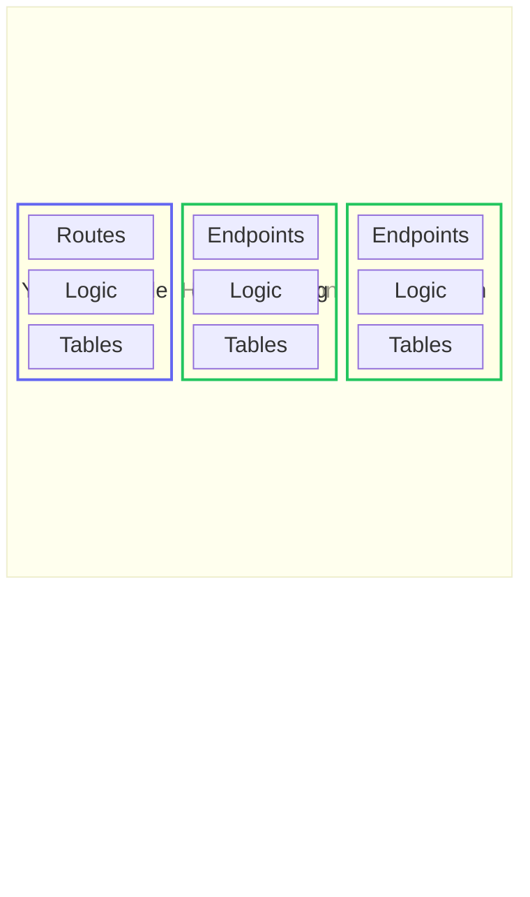

# Futonic 🛋️

**A framework for building services that embed into host applications instead of deploying alongside them.**

> Looking for how to build or mount a service? The usage reference lives in the package README: **[`packages/futonic/README.md`](./packages/futonic/README.md)**.

## The problem

There are plenty of services available as easy-to-deploy containers — auth servers, payment processors, observability tools. But for most applications, deploying multiple containers (one for the main app plus one for each service) is a waste. An auth server, a payment webhook handler, and an observability stack don't each need their own process. They could share compute and a database without any meaningful noisy-neighbor issues — because let's be honest, most apps these days are just wrappers around heavier services anyway.

## The idea

Futonic is heavily inspired by [better-auth](https://github.com/better-auth/better-auth)'s service embedding paradigm — the insight that many services don't need their own process, their own deployment, or even their own database. They just need a place to crash.

Futonic is a framework for building **embeddable services** that crash on a host application's futon. They share the host's compute. They share the host's database. They wake up when needed and stay out of the way when they're not.

No separate containers. No extra Dockerfiles. No internal networking. Just services that live inside the host app — and a great DX for building them.

## Why build embeddable services

**Your users save money:**
Most apps aren't mega-scale. They're tools, SaaS products, and indie projects where every dollar of infrastructure counts. When your service embeds directly into the host, your users don't need to pay for another container sitting idle 99% of the time.

**Your users get a better dev experience:**
No more `docker-compose up` with 6 services just to work on a feature. No more debugging why the auth container can't talk to the payments container on a laptop. Embedded services run in-process. Switch branches, switch worktrees — everything just works.

**Simplicity sells:**
Fewer moving parts means fewer things that break at 2am. One deploy. One database. One set of logs. Developers can always decompose later if they outgrow it — but most apps never will. The easier your service is to adopt, the more people will use it.

## How it works: the vertical slice

A futonic service is a **vertical slice** of your application. It defines everything from the client interface down to the database — API endpoints, input validation, business logic, and table schemas — as a single, self-contained unit, published as an npm package.



Each green block is a futonic service — a vertical slice that owns its entire stack. The host application mounts them alongside its own code. They all share one process, one database, one deployment.

This is what makes futonic different from microservices. A microservice is also a vertical slice, but it pays for that independence with its own container, its own deployment pipeline, and network hops between every call. A futonic service gets the same self-containment for free:

- **No deployment cost.** It runs inside your existing process. No extra containers, no extra infrastructure, no extra cloud bill.
- **No networking latency.** Service calls from backend code are direct function calls — same process, same database connection pool, zero serialization.
- **No protocol constraints.** Endpoints are built on web-standard `Request`/`Response`, so a service can return JSON, full HTML pages, server-sent event streams, file downloads — anything `Response` supports.

A service defines its tables and endpoints with `defineService`, exports a constructor built by `createFutonicServiceConstructor`, and the host mounts the resulting handler on one catch-all route — never importing futonic itself. See **[`packages/futonic/README.md`](./packages/futonic/README.md)** for the full walkthrough.

## Things you could build

- **Auth service** — User management, sessions, OAuth flows, and permissions. Like better-auth, but packaged as an embeddable service.
- **Payment service** — Webhook handlers, invoice management, subscription state. A reusable Stripe integration that anyone can drop into their app.
- **Observability service** — An API for ingesting traces, database tables for storing them, and an embedded UI for visualizing them. Jaeger without the deployment.
- **Feature flags** — A flag service with an admin UI, backed by the host's existing database.
- **CMS** — Content management endpoints with an embedded editor interface.
- **Notifications** — Email/push queue management with status tracking and retry logic.

## Repository

This is a [Bun](https://bun.sh) workspace monorepo.

| Package | Description |
| --- | --- |
| [`futonic`](./packages/futonic) | The framework — service constructor, typed client, and Drizzle schema generation. Published to npm; see its [README](./packages/futonic/README.md) for usage. |

## Development

```sh
bun install       # install workspace deps
bun run build     # bundle + emit declarations
bun run test      # run the test suite
bun run typecheck # type-check
bun run lint      # biome check
bun run format    # biome format
```

Watch-run the package entry during development with `bun run --cwd packages/futonic dev`.

Releases are managed with [changesets](https://github.com/changesets/changesets): add one with `bunx changeset` describing any user-facing change.

## License

MIT
